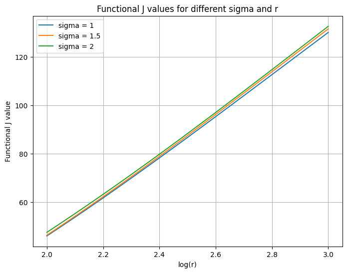
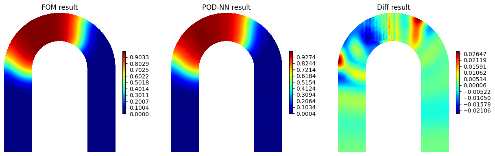

# MOR-Damage-Propagation-in-U-Bolts
This is a project on analyzing damage propagation in a U-bolt by implementing Model Order Reduction Techniques such as DL-ROM and POD-NN

# Model Order Reduction for Damage Propagation in a U-Bolt

[](https://www.python.org/downloads/)
[](https://pytorch.org/)
[](https://numpy.org/)
[](https://matplotlib.org/)

This repository contains the implementation of a project for the "Model Order Reduction techniques" course. The goal is to develop and analyze data-driven **Reduced Order Models (ROMs)** to efficiently simulate the physical phenomenon of damage propagation in a U-bolt, governed by the **Fisher-KPP equation**.

The high computational cost of running traditional **Finite Element Method (FEM)** simulations—our Full Order Model (FOM)—makes real-time analysis infeasible. To overcome this, we leverage data-driven ROMs, specifically **POD-NN** and **DL-ROM**, to create fast and accurate surrogate models.

---

## 🚀 Showcase & Results

### Model Performance & Speed-Up
The developed ROMs not only accurately predict the damage evolution but also provide a massive computational speed-up, making real-time parametric studies possible.

| Model | Avg. Relative L2 Error | Time for 1 Trajectory | Speed-up Factor |
| :--- | :---: | :---: | :---: |
| **FOM** | - | ≈ 19.33 seconds | 1x |
| **POD-NN** | 4.82% | ≈ 3.67 milliseconds | **~5200x** |
| **DL-ROM** | **2.78%** | *(similar to POD-NN)* | **~5000x+** |

### Parametric Study using the ROM
The trained ROM allows us to perform studies that would be too costly with the FOM. The plot below shows how the total damage ($J$) changes as a function of the material's reaction coefficient ($r$) for different initial damage locations ($\delta$).

 
*<p align="center">Figure: The total damage J increases with the reaction coefficient r. This plot was generated almost instantly using the ROM.</p>*

---

## 🔧 How It Works

### 1. The Full Order Model (FOM)
The physical phenomenon is described by the time-dependent, non-linear Fisher-KPP equation.

$$
\begin{cases}
\frac{\partial u}{\partial t} - D\Delta u = ru(1 - u) & \text{in } \Omega \times (0, T] \\
\nabla u \cdot \mathbf{n} = 0 & \text{on } \partial\Omega \times (0, T] \\
u(\cdot, 0) = g_{\delta} & \text{in } \Omega
\end{cases}
$$

The system is parameterized by $\boldsymbol{\mu} = [\mu_1, \mu_2, \mu_3]^T \in [0, 1]^3$, which control:
- **Diffusion coefficient**: $D = 10^{\mu_1}$
- **Reaction coefficient**: $r = 10^{\mu_2 + 2}$
- **Initial damage location**: $\delta = \mu_3 + 1$

The project uses a pre-computed dataset of **100 FOM simulations**, each with **41 time snapshots** and **6636 degrees of freedom**.

### 2. Data-Driven Reduced Order Models (ROMs)
We explored two techniques, splitting the data into 75 trajectories for training and 25 for testing.

#### A. POD-NN
This method combines a linear subspace projection with a neural network.
1.  **Proper Orthogonal Decomposition (POD):** We use SVD to extract an optimal basis of **n=80** modes that capture **99.99%** of the data's energy.
2.  **Neural Network (NN):** A Deep Feedforward Neural Network learns the mapping from the input parameters $(\boldsymbol{\mu}, t)$ to the POD modal coefficients.


*<p align="center">Figure: Visual comparison between the ground truth FOM (left), the POD-NN prediction (center), and the difference (right).</p>*

#### B. DL-ROM (Deep Learning ROM)
This is a non-linear approach using an autoencoder.
1.  **Autoencoder (AE):** An AE learns to compress the high-dimensional state into a low-dimensional latent space (**n=9**) and then reconstruct it.
2.  **Dynamics Network ($\Phi$):** A separate neural network predicts the evolution of the latent state based on the input parameters.

### 3. Analysis of the Quantity of Interest (QoI)
We analyzed the overall damage, defined by the functional $J(u) = \frac{1}{T} \int_0^T \int_\Omega u(\mathbf{x}, t) d\mathbf{x} dt$. The **POD-NN model** proved highly reliable in predicting this value, with a relative error of only **0.62%** on the test set.


*<p align="center">Figure: The POD-NN model's predictions for the functional J closely track the FOM ground truth across all test simulations.</p>*

---

## 💻 How to Run

### Dependencies
The project relies on standard Python libraries for scientific computing. A `requirements.txt` can be created with the following:
torch
numpy
matplotlib
gdown
scipy

The project also uses the custom `dlroms` library provided by the course instructors.

### Instructions
1.  **Clone the repository:**
    ```bash
    git clone https://github.com/YOUR_USERNAME/YOUR_REPO.git
    cd YOUR_REPO
    ```

2.  **Install dependencies:**
    ```bash
    pip install torch numpy matplotlib gdown scipy
    pip install --no-deps git+https://github.com/NicolaRFranco/dlroms.git
    ```

3.  **Run the Jupyter Notebook:**
    Launch the `MOR_U-Bolt_Project.ipynb` notebook.
    ```bash
    jupyter notebook MOR_U-Bolt_Project.ipynb
    ```
    The notebook is self-contained and will automatically download the necessary dataset and mesh files. It includes all steps from data loading to model evaluation. Pre-trained models can be loaded to reproduce the results instantly.

---

## 🏁 Conclusion

This project successfully demonstrates the power of data-driven model order reduction for complex physical simulations.
- We developed two ROMs (**POD-NN** and **DL-ROM**) that accurately model damage propagation.
- We achieved a computational **speed-up of over 5000x**, enabling real-time analysis.
- The **POD-NN** model, despite a slightly higher reconstruction error, proved more robust and reliable for predicting the integrated quantity of interest and for performing parametric studies.

## 🙏 Acknowledgments

This project was completed for the "Model Order Reduction techniques" course (A.Y. 2024-2025) at **Politecnico di Milano**, taught by Prof. Nicola R. Franco and Prof. Andrea Manzoni.
